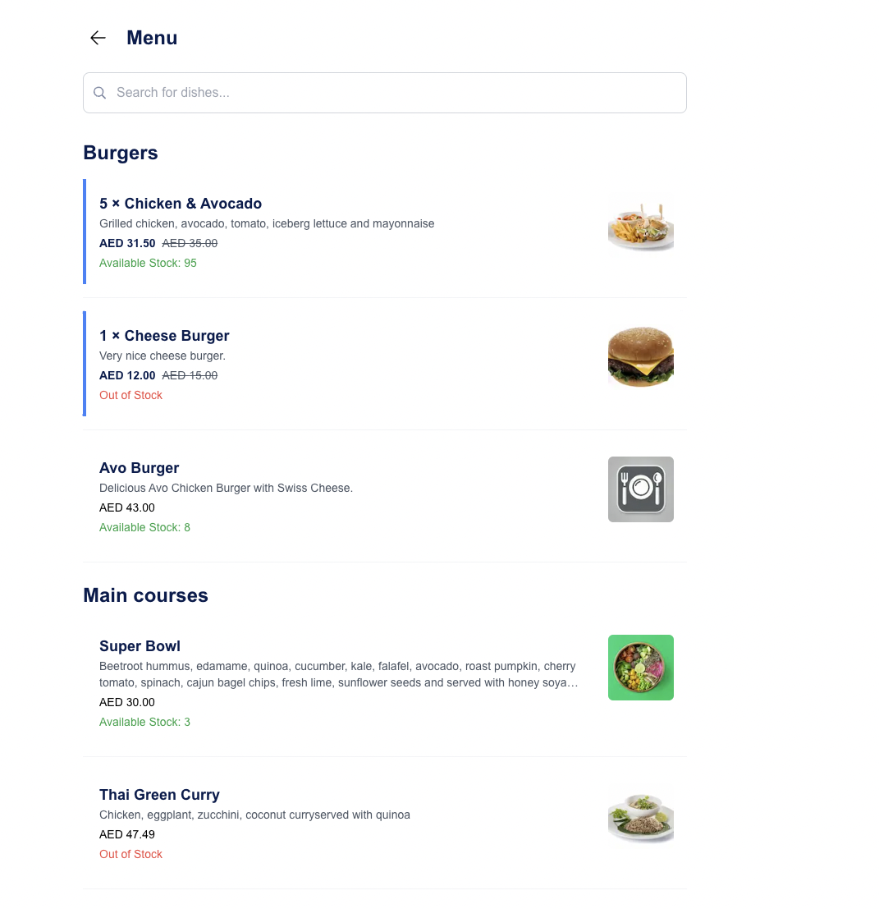

# Deliverect Restaurant Menu

A dynamic single-page application to display and manage a restaurant's menu with advanced features such as search, basket management, and stock availability tracking.

## Installation

- Use the right node version required for this project with _nvm_:

  ```
    nvm use
  ```

- Install dependencies with _yarn_:

  ```
    yarn
  ```

- Run the development server:

  ```
  yarn dev
  ```

- Build and run the production server:

  ```
  yarn build && yarn start
  ```

- To lint and test the codebase with linters:
  ```
  yarn test-all
  ```

## Environment Setup

- Create an `.env` file in the root of the project, with the content :
  ```
    NEXT_PUBLIC_CHATFOOD_CDN_URL=your-api-domain-name
  ```

## Hosted Application

The application is hosted live [here](https://deliverect-restaurant-menu.vercel.app).

## Goal and Case Study

This application provides a user-friendly interface for browsing restaurant menus, filtering items, adding them to a basket, and managing stock limits.

- Users can filter menu items by name.
- Clicking on a menu item will add it to the basket, increasing the quantity until stock availability is reached.
- Displays discounted prices where applicable.
- The basket persists in the browser's local storage.
- Search results dynamically update as the user types, with debounced search handling for optimized performance.

Here's an overview of how the interface works:

- **Menu Page**: Users can browse the menu items by category and view each item's available stock.
- **Basket Management**: Users can add items to the basket and manage the quantity, with stock limitations reflected in real-time.

## Technical Highlights and Notes

- **Third-party Packages**: No third-party libraries were used for any core logical operations.
  - Common utility functions are implemented in [Helpers](./common/utils/helpers.ts).
  - State persistence for the basket is managed using a custom [hook](./hooks/useBasketPersistence.ts).
- **Next.js**: Used as the framework to handle both server-side rendering and client-side interactions.
- **TypeScript**: Strongly typed language to catch errors early and improve code maintainability.
- **Zustand Store**: Simple yet powerful state management for handling basket and menu state.
- **Tailwind CSS**: Utility-first CSS framework used for quickly styling components.

## Codebase Quality Control

- Pre-commit hooks via Husky.
  - This uses prettier and eslint configs together to setup linting when commiting.
- Linting and testing are automated with [Linter Workflow File](./.github/workflows/linter.yml) and [Tests Coverage Workflow File](./.github/workflows/test.yml).
  - **Linting**: A linter action runs on each pull request, ensuring code adheres to the Prettier and ESLint configurations before being merged.
  - **Testing**: Automated tests are triggered on each pull request using `jest` to run unit tests and ensure all components and functionality are covered.
  - These checks are integrated as status checks for pull requests to ensure that only well-linted and tested code is merged.

## Key Features

- **Filtering and Search**: Users can search for menu items by name and description. An empty state with an illustration is shown if no results are found.
- **Stock Tracking**: The app ensures users cannot add more items to their basket than are available in stock. Out-of-stock items are marked and disabled.
- **Persistent Basket**: The basket state is saved in local storage, allowing users to navigate or reload the page without losing their selections.
- **Dynamic Search**: The search input is debounced to improve performance and avoid unnecessary state updates.
- **Error Handling**: Graceful error handling for failed API requests and fallback UI states.

## Design Overview

The layout follows a clean, minimalistic design that ensures a good user experience for browsing and managing the restaurant's menu.



The core structure consists of:

1. **Menu Page**: Displays categories and menu items with filtering and search functionality.
2. **Basket Management**: Allows users to manage their selected items and view stock limits in real time.
3. **Persistent State**: Ensures that the basket is preserved across page reloads.

## Disclaimer and Design Choices

- **State Management**: Zustands' simple API was chosen for managing the application's state efficiently without overcomplicating the structure.
- **Stock Validation**: The app ensures that the stock availability is maintained and no more than the available items are added to the basket.
